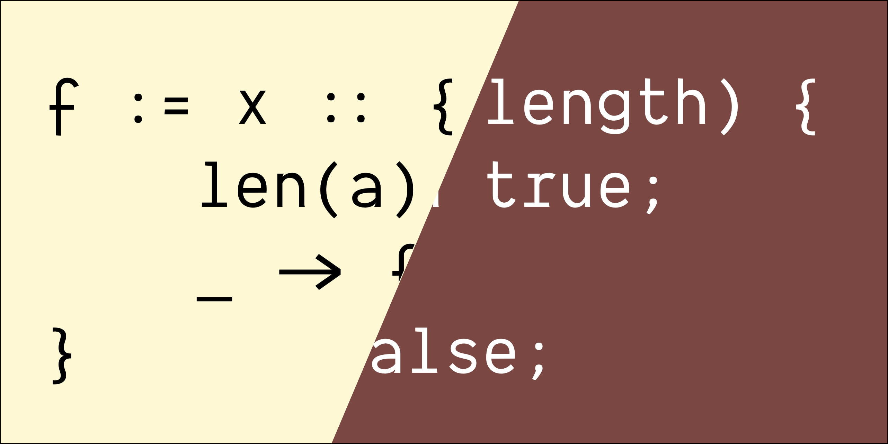

# September 🐞

**September** is an [Ink](https://github.com/thesephist/ink) to JavaScript compiler and toolchain for cross-compiling Ink applications to Node.js and the Web. September aims to be self-hosting on Node.js and pass all tests against Ink's core standard library test suite. I've also written about building September on the [Ink language blog](https://dotink.co/posts/september/).



## Contents

1. [Usage](#usage)
2. [How it works](#how-it-works)
3. [Performance](#performance)
4. [Future work](#future-work)
5. [Prior art](#prior-art)

---

## Usage

We can use September to translate Ink programs to JavaScript programs. If you have Node.js installed, September can also compile and run Ink code on Node.js.

To compile Ink program files (say, `a.ink`), run `september translate` to compile and print the result.

```sh
$ cat a.ink # example program
std := load('./runtime/std')

log := std.log

a := 2
b := 3

log(a + b)
log('Hello, World!')

$ september translate a.ink # compile to JS
std = load(__Ink_String(`./runtime/std`));
log = (() => {let __ink_acc_trgt = __as_ink_string(std); return __is_ink_string(__ink_acc_trgt) ? __ink_acc_trgt.valueOf()[log] || null : (__ink_acc_trgt.log !== undefined ? __ink_acc_trgt.log : null)})();
a = 2;
b = 3;
log(__as_ink_string(a + b));
log(__Ink_String(`Hello, World!`))
```

When we run Ink programs compiled to JavaScript, Ink requires a small [runtime](https://en.wikipedia.org/wiki/Runtime_library) (available in [runtime/ink.js](runtime/ink.js)). `september translate-full` prints the compiled JavaScript program alongside the necessary Ink runtime.

`september run` will compile the Ink program and pass it to Node.js, if installed, to execute it immediately.

```sh
$ september run a.ink # run Ink program in Node.js
5
Hello, World!
```

`september run` currently swallows any errors emitted by Node.js. During debugging it's helpful to run Node separately and pass it the program through stdin, so Node.js can emit any errors to stderr.

```sh
$ september translate-full a.ink | node -- # run Ink program through Node, emit stderr
5
Hello, World!
```

Because September contains a fully self-hosted tokenizer and parser, September can also simply syntax highlight Ink programs. To print an Ink program with syntax highlighting, use `september print`.

```sh
$ september print a.ink
std := load('./runtime/std')

log := std.log

a := 2
b := 3

log(a + b)
log('Hello, World!')
```

All September commands accept multiple files as input. If we want to run `a.ink` and `b.ink`, just run `september run a.ink b.ink`.

## How it works

September, like any compiler, works in stages:

1. **Construct an Ink parse tree** (`tokenize.ink`, `parse.ink`). This produces a data structure called the abstract syntax tree that represents well-formed Ink programs in a way the rest of September can understand. The syntax tree contains constructs like "binary addition expression" and "variable reference" and "function call".
2. **Semantic analysis** and annotation over the syntax tree (`analyze.ink`). During semantic analysis, September tries to infer some information that isn't available in the syntax tree itself, and makes it available to the code generator so it can generate better, correct code. Semantic analysis also transforms some syntax tree nodes to simpler or more correct ones, like eliminating unused expressions, moving some variable declarations to the top of a scope, or transforming tail calls to be eliminated into loops.
3. **Code generation** (`gen.ink`). The code generator takes the annotated syntax tree and outputs a JavaScript program that implements it.

Because Ink and JavaScript have many high-level similarities, September doesn't need an intermediate representation -- code generation is done straight from an annotated syntax tree.

For operations where Ink and JavaScript behave differently, September has two solutions with different tradeoffs.

1. **Inline code**: During code generation, September can insert a layer of indirection inline to mimic Ink's behavior within JavaScript. For example, Ink doesn't have explicit variable declarations (like Python, first use is declaration) but JavaScript uses `let` for local variables. September therefore computes where first use of variables are in the Ink syntax tree, and annotates them so the code generator can insert `let` statements where appropriate.
2. **Runtime library**: Some differences, like different behaviors of arithmetic operators, are better emulated by calling into a pre-defined JavaScript function from the generated code. For example, the negation operator `~` in Ink maps to two different JavaScript operators, depending on the type of the operand. Rather than pack this code inline, the generated code calls out to `__ink_negate()`, a runtime library function written in JavaScript that implements `~` in JavaScript.

Most of the time, the correct translation is a combination of some inline transformation and runtime facility. For example, in Ink, the assignment operator `:=` can mutate strings. JavaScript strings are not mutable. So Ink transforms string mutations in Ink to a JavaScript expression that checks the type of an object with inline code, and conditionally calls a runtime function to mutate the mutable string object, which is implemented in the runtime.

**September makes the following code transformations.**

### Operators

- `~`: runtime function `__ink_negate` which performs a `-` if argument is number, `!` otherwise.
- Basic arithmetic (`+ - * / %`) are translated verbatim, because they are valid JavaScript.
- The equality comparison `=` does deep comparisons in Ink, which does not have a native JavaScript equivalent. Instead, we call out to a performance-optimized runtime function `__ink_eq` which has fast paths for simple types, and does deep comparisons for composite values.
- `>` and `<` are translated literally, as the semantics in Ink and JavaScript match.
- `.`: the property access operator works the same way in JavaScript (with some caveats outlined in the "composite values" section below), but the operator precedence is different. Specifically, function calls on the right side of `.` need to be parenthesized in JavaScript because it has higher precedence in Ink.
- Binary combinators `& | ^` have different behavior for numbers and booleans in Ink, like the fact that they do not short circuit in Ink, so they call out to their respective runtime functions, `__ink_{and, or, xor}`.

### Values and types

- The **null** value `()` is translated to `null` in JavaScript.
- Ink **numbers** are 64-bit floating point numbers, and are translated directly to JavaScript `number` values.
- Ink **booleans** are `true` and `false` symbols and are translated literally to JavaScript boolean values.
- **Strings** in Ink are mutable, which means we cannot simply substitute them for JavaScript strings. However, JavaScript strings are heavily optimized, and we want to take advantage of those optimizations. So to represent Ink strings, we wrap JavaScript strings in an `__Ink_String` class, which exposes methods for mutation and degrades gracefully to native JavaScript strings when interfacing with native JavaScript functions that take strings.
- Translating **composite** values in Ink is more involved. While the value itself behaves like JavaScript objects or arrays, property access and assignment semantics differ, and Ink uses the single composite type for both list and map style data structures. Specifically, we make the following translations:
	- Composites initialized with `[]` are translated to JavaScript arrays.
	- Composites initialized with `{}` are translated to JavaScript object literals.
	- Assignment to a composite value is translated directly. i.e. The Ink program `c.(k) := v` is translated to `c[k] = v`. Notably, `c.k := v` is also translated to `c[k] = v` because `k` can be a numeric identifier in Ink, as in `c.2 := 3`.
		- Assignment `c.k := v` evaluates to `c` in Ink, but `v` in JavaScript. The compiler wraps assignments to composite properties so this behavior is preserved.
	- Property access like `c[k]` is wrapped with a nullability check. This is because accessing properties in Ink returns `()` but `undefined` in JavaScript, so we need to check if the returned value is `undefined` and return `null` instead if so.

Ink has a special value `_` (the empty identifier), which is mapped to a `Symbol` in JavaScript. The empty identifier has special behavior in equality checks, defined in `__ink_eq`.

### Variable binding and scope

Ink variables follow strict lexical binding and closely mirrors JavaScript's lexical binding rules. Because Ink variable bindings are always mutable, September defaults to translate all variable declarations (first variable reference in a scope) to a `let` declaration in JavaScript except top-level variables, which become globals in JavaScript. During semantic analysis, the compiler recognizes first assignments to names in a given scope and annotates each so it can be compiled to a `let` binding.

In Ink, a variable declaration is an expression; in JavaScript it is a statement. This means variable bindings may need to be pulled out of an expression in Ink into its own statement in JavaScript.

Further optimizations may be added in the future. In particular, normalizing expressions to [SSA](https://en.wikipedia.org/wiki/Static_single_assignment_form) might be interesting, though I suspect V8 already optimizes JS this way under the hood, so performance advantages might be underwhelming.

### Functions

The behavior of Ink functions is a strict subset of that of JavaScript functions, so in translating Ink to JavaScript, we can map function definitions and invocations directly to JavaScript equivalents.

One caveat is that, although modern JavaScript functions are tail-call-optimized by specification, only JavaScriptCore (Safari) implements it in practice. This means functions with recursive tail calls need to be transformed during compilation into a non-recursive form.

When calling a function that invokes recursive tail calls (calls to itself by its original bound name within its body), September detects it and automatically unrolls it into a [trampoline](https://en.wikipedia.org/wiki/Trampoline_(computing)) construct with a JavaScript `while` loop. This means September eliminates self-tail calls. However, JS limitations mean September cannot tail-call-eliminate mutual recursion.

### Match expressions

In this first version of September, match expressions call out to the Ink runtime using the `__ink_match()` function, which takes match targets and clauses as closures. The compiler transforms a match expression into a single call to `__ink_match` with the correct closures.

In the future, I hope to optimize the function away and compile matches straight down to `if...else` or `switch` blocks.

### Module system and imports

The `load()` Ink builtin, normally used for module imports, is mapped transparently to Node.js's `require()` in the runtime. This means Ink code compiled with September can reference other JavaScript programs with the built-in module system.

Importing Ink modules with `load()` is a work in progress.

## Performance

Modern JavaScript runtimes are fast (though perhaps at the expense of memory footprint). Even in the current prototype that performs little to no optimizing transformations, Ink code compiled with September runs significantly faster on the V8 engine than when the Ink code is run natively with the [Go-based interpreter](https://github.com/thesephist/ink), for certain workloads like numeric compute.

### Optimizations

September is designed to be an optimizing compiler. It aims to make the following optimizations.

- [ ] Dead branch elimination
- [ ] Common subexpression elimination
- [ ] Static branch elimination by type propagation
- [ ] Inlined match expressions (rather than relying on a runtime function)

## Future work

This is an informal list of things I'd like to implement, but haven't had time to yet.

- Performance optimizations
- Tests should run through all valid test cases in `test/cases/` and compare that the output for programs running on Node.js matches the output when run on Ink's Go interpreter.
- Interoperability with JavaScript classes. Ink programs can currently construct objects with the runtime function `obj := jsnew(constructor, args)`, but cannot extend JavaScript classes properly.

## Prior art

Language-to-language compilers is a rich and deep field with lots of priors. A few that were especially helpful are:

- [Fengari](https://fengari.io), a Lua runtime on top of JavaScript. Especially helpful in thinking about how to translate mutable strings and Ink-JavaScript interoperability.
- [Babel](https://babeljs.io), the industry standard JavaScript compiler.
- [Ivy](https://github.com/robpike/ivy), an interpreter written in Go for an APL-like language, with an elegant parser design.
- [The 2ality blog](https://2ality.com/2011/12/fake-operator-overloading.html) for ideas about how to implement mutable strings that fallback gracefully to native JS strings, and further minutiae of JavaScript's lesser known rules.

and of course,

- [The canonical implementation of Ink](https://github.com/thesephist). The parser and tokenizer in September are very much inspired by their Go equivalents.
